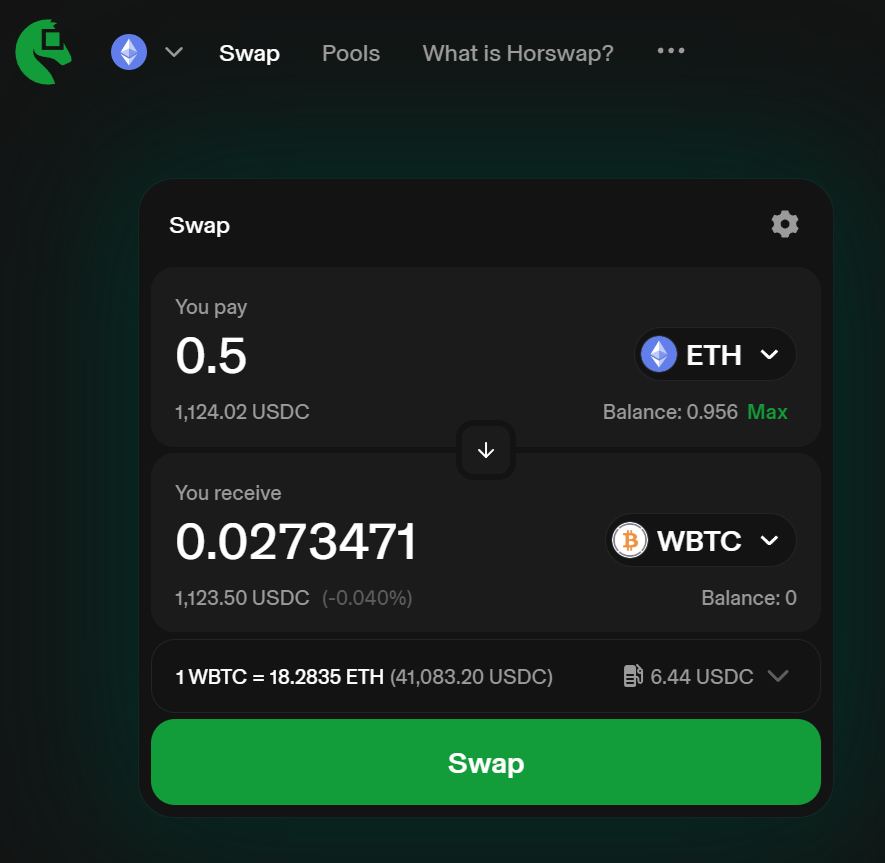

# Horswap

An open source interface for Uniswap -- a protocol for decentralized exchange of Ethereum tokens.

Check out Horswap via:
- [https://2.horswap.eth.limo](https://2.horswap.eth.limo)
- [ipns://2.horswap.eth](ipns://2.horswap.eth)
- [ipfs://bafybeibtdjzmhx77pxlpmy7fqnwyb7dmrtwbk3n6fpyw3qdgmxaznzwm44](ipfs://bafybeibtdjzmhx77pxlpmy7fqnwyb7dmrtwbk3n6fpyw3qdgmxaznzwm44)

# Jingo Finance is an improved Uniswap Interface
Horswap is a fork of [Uniswap Interface v4.266.2](https://github.com/Uniswap/interface/releases/tag/v4.266.2). The version v4.266.2 is the last version without added UI fees and that would still allow users to do local routing. Horswap has then significantly improved the interface's censorship resistance and privacy.
